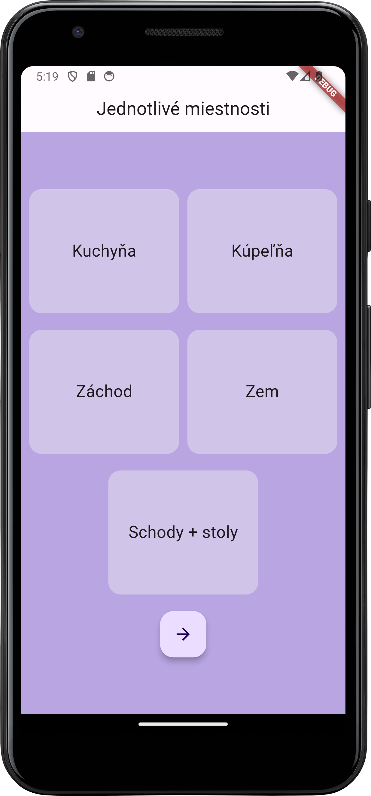
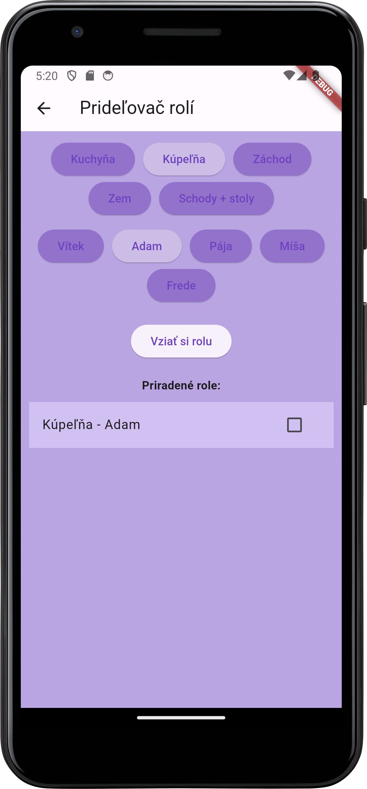
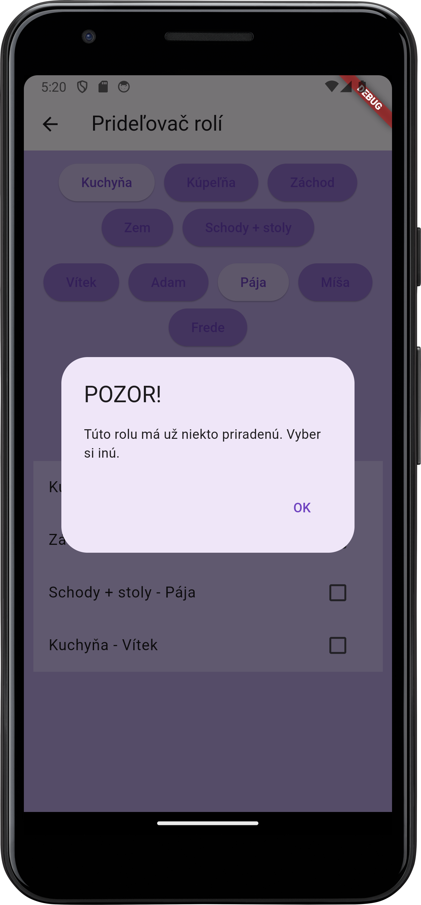

#  Simple cleaning app

A simple cleaning app for an android phone where you can pick a name, assign a task or read instructions on what to clean where.

##  Technologies

- Android Studio
- GitHub
- Flutter
- Nucleo

##  Features

This is what you can do with the cleaning app:

- **Pick a box**: Click a place, where you want to know what is supposed to be cleaned/done, and check your task when you are done.
- **Add a task**: Pick your name and a place where you want to clean, click "Vziať si rolu:" and your role is assigned.
- **Finishing**: When you are done with the task, you can unasign yourself from it by clicking the checkbox.

##  Process

I started by downloading the Flutter SDK and Android Studio, making an Google Pixel virtual machine and mocking up my ideas in Figma.

When the first sketches cam to life, I started implementing titles for each page with the same background.

As a next step i started making each page. For the first page I made a simple grid 2x2 and for the last place, i left the box centered. Under all of that I implemented a button that would get you to the next page which is task assigning.

Task assigning is really simple, by picking your name and a place which you want to clean and take care of for the month. By picking, the app would automatically write down a list of people assigned with places, so you know who is responsible for taking care of what place.

Along the way, I took notes on what should be improved in the future.

##  Improvements

- Making the app easier for users to work with
- Implementing a database for storing asigned tasks
- Making the app available for Android phones and Web Pages
- Making the app in different languages not only Slovak

##  Screenshots

